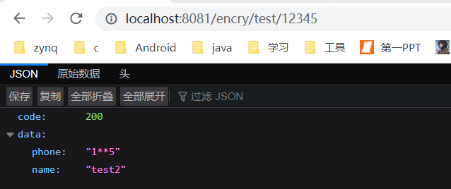

# 面向切面
## 1.对指定的返回参数脱敏参数
    1.encryption中自定义了Encry注解，并设置了参数。
    2.EncryAspect中定义了Encry为切面，并进行相应的处理。
    3.在EncryController中进行使用
[注解参数介绍](https://www.jianshu.com/p/6e02cf0822a5) ，[切面处理介绍](https://www.cnblogs.com/zyf-yxm/p/10833170.html)
