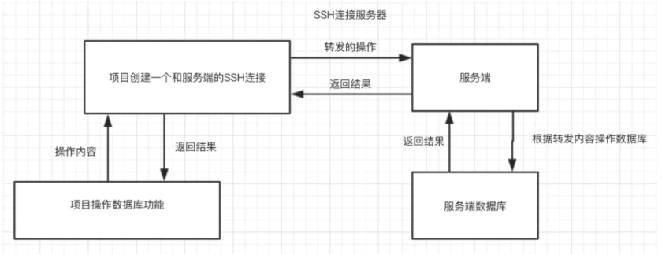

# mybatis 《mybatis从入门到精通》
## 1.通过ssh链接数据库
### 1.1依赖
    <dependency>
        <groupId>com.jcraft</groupId>
        <artifactId>jsch</artifactId>
        <version>0.1.55</version>
    </dependency>
    <dependency>
        <groupId>javax.servlet</groupId>
        <artifactId>javax.servlet-api</artifactId>
        <version>4.0.1</version>
    </dependency>
### 1.2 编写连接类 具体代码ssh文件夹下
### 1.3 配置mysql链接参数，需要注意的是端口是连接类中自己定义的端口
### 1.4 编写逻辑 [参考链接](https://www.jianshu.com/p/4ec1b70c0ada?tdsourcetag=s_pcqq_aiomsg)

### 1.5 注意细节 
    1.须在Application中添加 @ServletComponentScan 注解否则无法连接
    2.配置的本地跳转端口不能被占用
    3.如遇到连接8小时断开的问题需要添加连接池配置 
        #解决mysql 8小时的断开问题
        spring.druid.validationQuery=SELECT 'x'

## 2.mybatis简单使用。如 Country。通过xml的方式进行mysql数据的操作
## 3.xml的基本使用。
    1.映射：
        可以通过<resultMap>来映射数据库中的字段和Java类的字段
        也可以通过配置文件mybatis.configuration.mapUnderscoreToCamelCase开启驼峰命名
    2.返回主键key针对<insert>：
        可以使用<selectKey>标签，配合SELECT LAST_INSERT_ID()
        也可以配置<insert>标签的useGeneratedKeys、keyProperty属性
## 4.注解方式的基本使用
    1.映射：
        和3.1基本相同只是将xml中<resultMap>，改为通过@Results实现
    2.返回主键key
        和3.2相同，将<selectKey>，改为@SelectKey实现
        和3.2相同，使用@Options配置useGeneratedKeys、keyProperty属性
## 5.动态SQL
    1.if:通过标签中test的结果，来判断是否需要在sql中拼接标签中的内容
    2.choose:类似java中的switch case
    3.where:主要是为了解决可能出现的SQL语法错误，where中所有条件都不满足，
      sql也不会拼接WHERE关键字，避免xml中要写 WHERE 1=1 的情况
    4.set:和上方where一样为了避可能出行的SQL语法错误。当set中所有条件都不满足，
       sql也不会凭借SET关键字，避免了xml中要写 SET ... id = #{id} 的情况
    5.trim:和上方3.4一样为了解决SQL语法错误，并且3.4能做的trim都可以做。
    6.foreach:类似java中的for循环。循环的内容可以是集合、数组、Map
    7.bind:name/value结构，可以让上下文通过name使用value的值。
    8.OGNL用法:if中的test就是用的该语法。表达式有：
        或:or 且:and 等于:==/eq 不等于:!=/neq 小于:lt 小于等于:lte 大于:gt 大于等于:gte
        运算:+ - * / % 取反:! 调用方法:e.nethod(args) 对象属性值:e.property 
        按索引取值(List 数组 Map):e1[e2] 调用静态方法:@class@methid(arges)
        调用类的静态字段:@class@field
## 6.高级查询
### 6.1.高级结果映射
    1.一对一映射：在Bean1中添加对应映射的Bean2
        在xml中sql语句中使用Bean2在Bean1中的属性名的方式进行映射
        在<resultMap>中使用<association>进行映射
        使用<association>嵌套查询进行映射
    2.一对多映射：在Bean1中添加对应映射的List<Bean2>
        使用<collection>集合的嵌套结果映射
        使用<collection>集合的嵌套查询映射
    3.鉴别器映射：<discriminator>根据查询的结果返回不同的结果集类似于java中的swish
### 6.2.存储过程
    在xml中通过设置<select>、<insert>、<delete>
    中的statementType="CALLABLE"属性来调用存储过程
### 6.3.使用枚举或其他对象
    配置mybatis.typeHandlersPackage，和实现TypeHandler接口来进行Java类和SQL值的转换
## 7.缓存
    1.一级缓存(本地缓存)，默认启用，并且不能控制，只存在于SqlSession的生命周期中
    2.二级缓存，需要配置开启，可以进行控制，存在于SqlSessionFactory的生命周期中
## 8.MyBatis插件开发