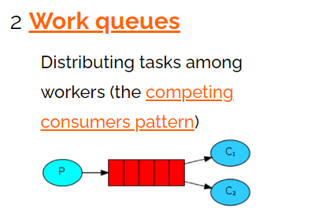

# Rabbitmq消息队列

## [docker安装Rabbitmq](https://www.cnblogs.com/yy-cola/p/11089800.html)
    docker run -itd --name rabbitmq \
    -p 15672:15672 -p 5672:5672 \
    -e RABBITMQ_DEFAULT_USER=admin -e RABBITMQ_DEFAULT_PASS=admin \
    rabbitmq:management

## [五种队列](https://www.rabbitmq.com/getstarted.html) [参考](https://blog.csdn.net/wd520521/article/details/110139307)  
P：消息的生产者  C：消息的消费者  红色：队列
* One 简单队列  

* Two Work模式  
一个生产者、2个消费者。
一个消息只能被一个消费者获取
  * 公平分发(自动确认) 每个消费者获取的消息是相同的 recv1()  
    只要消息从队列中获取，无论消费者获取到消息后是否成功消息，都认为是消息已经成功消费
  * 轮询分发(手动确认) 每个消费者获取的消息是不同的，那个处理的快那个获取的多 recv2()  
    消费者从队列中获取消息后，服务器会将该消息标记为不可用状态，等待消费者的反馈，如果消费者一直没有反馈，那么该消息将一直处于不可用状态

  
* Three 订阅模式  
一个生产者多个消费者，每个消费者都有自己的一个队列，每个队列都绑定在交换机上
生成者将消息发送到交换机，由交换机发送到队列。可以实现一个消息发送给多个队列
   
* Four 路由模式  
和订阅模式不同的是，通过key将消息发送给指定的队列，如果key没有匹配的队列，消息将丢失  
   
* Five 主题模式（通配符模式）  
和路由模式不同的是，通过通配符进行匹配消息队列，通过*和#匹配
  
   