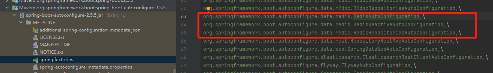
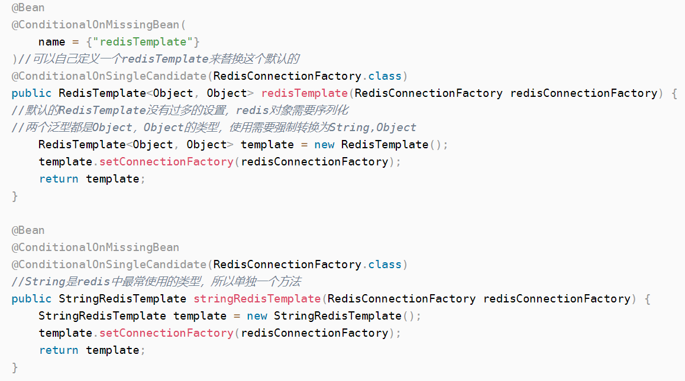

# Redis

## Jedis [参考](https://blog.csdn.net/qq_43178138/article/details/117166057)
Jedis是一个高性能的开源Java客户端，是Redis官方推荐的Java开发工具
* 在SpringBoot2.x之后，原本使用的jedis被替换为了lettuce。
  * jedis：采用直连，多个线程操作的话是不安全的，如果要避免不安全的情况，要使用JedisPool连接池，像BIO，又有其他问题。
  * lettuce：底层采用netty，实例可以在多个线程中进行共享，不存在线程不安全的情况，可以减少线程的数量，更像NIO模式。

## redis自动装配
在org.springframework.boot:spring-boot-autoconfigure-2.5.5.jar中可以看到关于自动配置的信息

其中第一个就是redis的自动装配。进入该方法可以看到几个注解，其中的
* @EnableConfigurationProperties(RedisProperties.class)就是连接属性，进入就能看到redis的配置属性。
  * RedisProperties中的@ConfigurationProperties(prefix = "spring.redis")就对应配置文件中的属性。如端口默认6379等
* @Import  将指定类型的组件导入,给容器自动创建出指定类的无参构造器返回的组件

## 哨兵模式
在sentinel中使用的是哨兵模式来获取redis的连接并进行使用，经测试并未进行读写分离